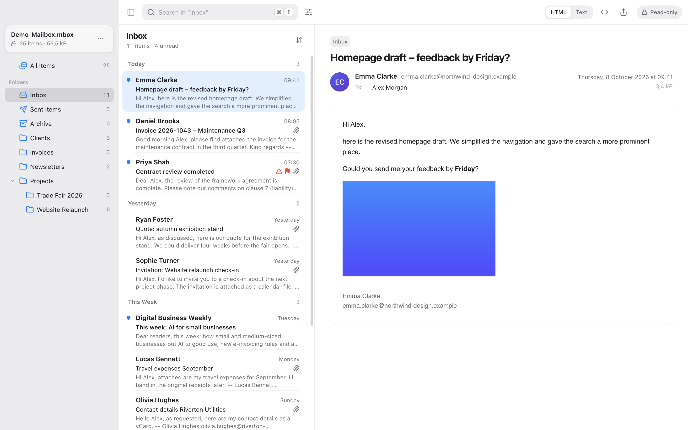
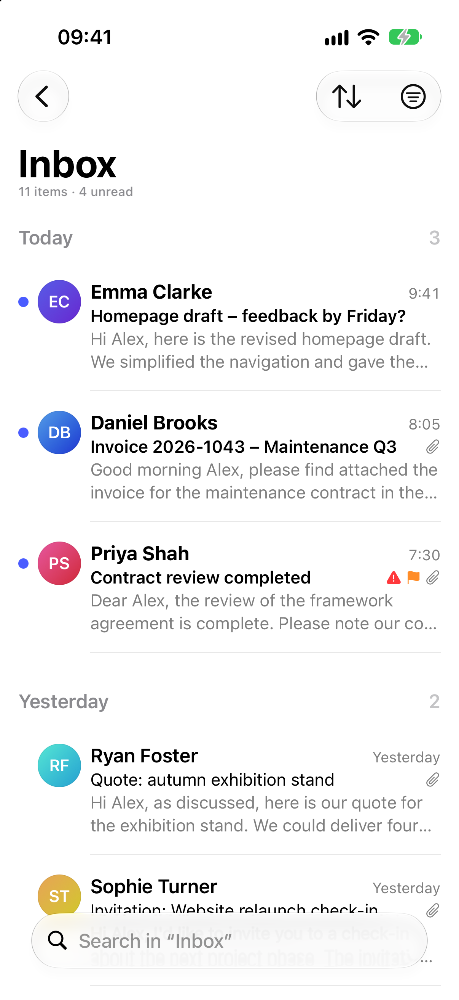
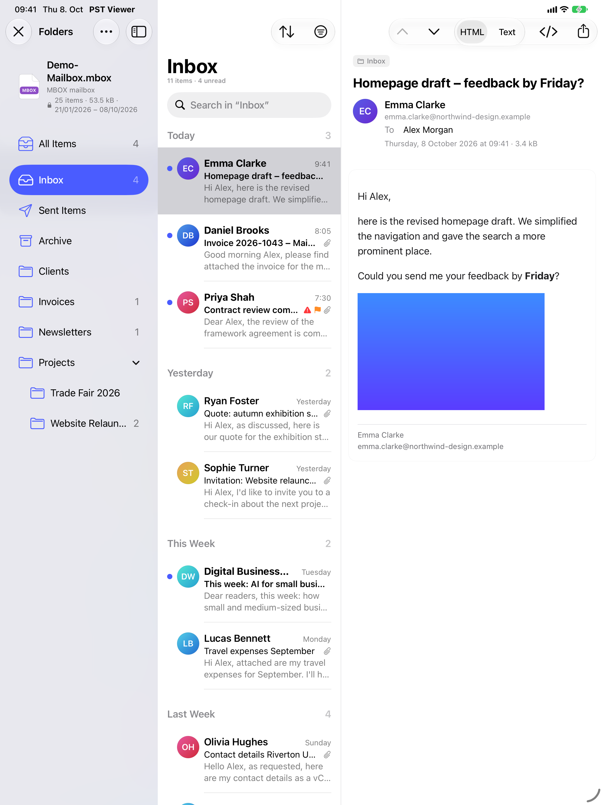
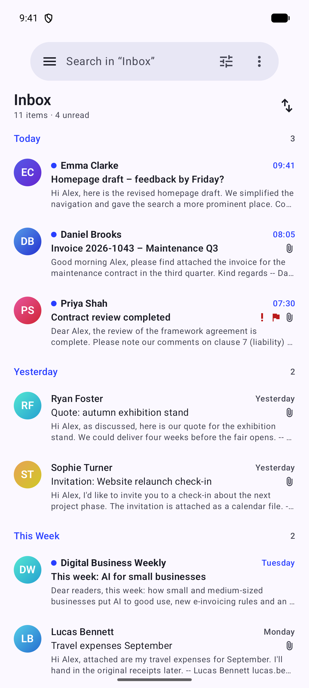

<div align="center">


# PST Viewer

**Open, search and read Outlook data files and mail archives: fast, strictly read-only, on every device.**

[](https://github.com/mariokernich/pst-viewer/actions/workflows/ci.yml)
[](https://github.com/mariokernich/pst-viewer/releases/latest)
[](LICENSE)


[**Download**](#download) · [Website](https://mariokernich.github.io/pst-viewer/) · [Documentation](https://mariokernich.github.io/pst-viewer/en/docs/) · [Releases](https://github.com/mariokernich/pst-viewer/releases)

<br>

<picture>
  <source media="(prefers-color-scheme: dark)" srcset="docs/screenshots/desktop-dark-en.png">
  
</picture>

</div>

## Why PST Viewer?

Old mailboxes tend to survive as `.pst` files, Google Takeout exports or folders full of `.eml` files, and opening them usually means installing Outlook or importing everything into a mail client. PST Viewer opens them directly, finds any message in seconds, and **never changes a single byte of your files**.

- 📂 **Many formats:** Outlook data files (`.pst`, also multi-gigabyte archives), Outlook items (`.msg`), emails (`.eml`, Apple Mail `.emlx`), MBOX mailboxes (Gmail/Google Takeout with labels as folders, Apple Mail, Thunderbird) and whole folders of mail files.
- ⚡ **Fast:** the message list appears in about a second; the full-text index is built in the background.
- 🔎 **Search that finds things:** search as you type across all folders, filters for date, people, attachments, file types, unread, important and flagged messages, plus a search syntax in English and German (`from:anna has:attachment after:2024-03-01`). Accent-insensitive, so `muller` also finds `Müller`.
- 📖 **Comfortable reading:** a familiar three-pane layout, safe HTML rendering with remote images blocked until you allow them, appointments, contacts, tasks, signed messages and attached messages to any depth.
- 📎 **Attachments and export:** preview PDFs, images, text, CSV tables, calendar and contact files without saving them first; save one or all attachments; export messages as PDF, `.eml` or plain text, or print them.
- 🔒 **Private by design:** strictly read-only, works offline, no account, no tracking, no analytics. Everything stays on your device.
- 🌍 **German and English**, light and dark mode, keyboard shortcuts, accessibility support.

## Mobile apps

The iPhone, iPad and Android apps offer the same features, built on a shared Rust core.

<table>
  <tr>
    <td align="center" width="25%"><br><sub>iPhone</sub></td>
    <td align="center" width="45%"><br><sub>iPad</sub></td>
    <td align="center" width="30%"><br><sub>Android</sub></td>
  </tr>
</table>

## Download

PST Viewer is free and open source. Downloads for every release are on the [releases page](https://github.com/mariokernich/pst-viewer/releases/latest):

| Platform | Download |
| --- | --- |
| macOS (Apple Silicon) | [PST-Viewer-mac-arm64.dmg](https://github.com/mariokernich/pst-viewer/releases/latest/download/PST-Viewer-mac-arm64.dmg) |
| macOS (Intel) | [PST-Viewer-mac-x64.dmg](https://github.com/mariokernich/pst-viewer/releases/latest/download/PST-Viewer-mac-x64.dmg) |
| Windows (x64) | [PST-Viewer-windows-x64-setup.exe](https://github.com/mariokernich/pst-viewer/releases/latest/download/PST-Viewer-windows-x64-setup.exe) |
| Windows (ARM64) | [PST-Viewer-windows-arm64-setup.exe](https://github.com/mariokernich/pst-viewer/releases/latest/download/PST-Viewer-windows-arm64-setup.exe) |
| Linux (AppImage) | [PST-Viewer-linux-x86_64.AppImage](https://github.com/mariokernich/pst-viewer/releases/latest/download/PST-Viewer-linux-x86_64.AppImage) |
| Linux (Debian, Ubuntu) | [PST-Viewer-linux-amd64.deb](https://github.com/mariokernich/pst-viewer/releases/latest/download/PST-Viewer-linux-amd64.deb) |
| Android | [PST-Viewer-android.apk](https://github.com/mariokernich/pst-viewer/releases/latest/download/PST-Viewer-android.apk) |
| iPhone and iPad | App Store (coming soon) or [build it yourself](apps/ios/README.md) |

> [!NOTE]
> The desktop builds may not be code-signed yet. On macOS, open the app the first time with right-click → **Open**; on Windows, choose **More info → Run anyway** in the SmartScreen dialog.

Free versions in the Mac App Store, Microsoft Store, App Store and Google Play are in preparation.

## Supported formats

| Format | Extensions | Notes |
| --- | --- | --- |
| Outlook data file | `.pst`, `.ost` | ANSI and Unicode; offline files (`.ost`) of Outlook 2013 and later are not supported |
| Outlook item | `.msg` | mails, appointments, contacts, tasks, attached items |
| Email | `.eml`, `.emlx` | MIME, S/MIME signed messages, Apple Mail flags |
| Mailbox | `.mbox` | Gmail/Google Takeout (labels become folders), Thunderbird, Apple Mail |
| Folder | – | folders of mail files, including Apple Mail mailbox folders |

## Repository

This monorepo contains all parts of the product:

| Path | What | Stack |
| --- | --- | --- |
| [`apps/desktop`](apps/desktop) | Desktop app for macOS, Windows and Linux | Electron, React, TypeScript |
| [`apps/ios`](apps/ios) | iPhone and iPad app | SwiftUI |
| [`apps/android`](apps/android) | Android app (phones, tablets, foldables) | Kotlin, Jetpack Compose |
| [`crates/core`](crates/core) | Shared engine of the mobile apps: PST/MSG/EML/MBOX reading, search, export | Rust, UniFFI |
| [`apps/web`](apps/web) | Website with documentation (DE/EN), hosted on GitHub Pages | Next.js |
| [`crates/vendor/outlook-pst`](crates/vendor/outlook-pst) | Microsoft's PST crate with small patches ([PATCHES.md](crates/vendor/outlook-pst/PATCHES.md)) | Rust |
| [`tools/demo-data`](tools/demo-data) | Generator for fictional demo mailboxes (tests, screenshots) | Python |
| [`docs`](docs) | [Release process](docs/release.md), [store guide](docs/store-release.md), screenshots | |

The desktop app has its own TypeScript engine (`apps/desktop/src/worker`); the Rust core is a port of it, so search syntax, filters and results behave the same everywhere.

## Building from source

Requirements: Node.js 22+ and pnpm (`corepack enable`); for the mobile apps also Rust ([rustup](https://rustup.rs)), Xcode and Android Studio with the NDK (see the app READMEs).

```bash
pnpm install
pnpm dev          # desktop app with hot reload
pnpm dev:web      # website on http://localhost:3000
pnpm test         # JavaScript tests
pnpm build        # build the desktop app and the website

cargo test --workspace                   # Rust core tests
crates/core/scripts/build-ios.sh         # core for the iOS app (XCFramework + Swift bindings)
crates/core/scripts/build-android.sh     # core for the Android app (.so libraries + Kotlin bindings)
```

More: [desktop](apps/desktop/README.md) · [iOS](apps/ios/README.md) · [Android](apps/android/README.md) · [Rust core](crates/core/README.md) · [website](apps/web/README.md)

## Contributing

Bug reports, ideas and pull requests are welcome; see [CONTRIBUTING.md](CONTRIBUTING.md). Please never attach real mailboxes to issues: create a sample with [`tools/demo-data`](tools/demo-data) or remove private content first. Security issues: see [SECURITY.md](SECURITY.md).

## License

[MIT](LICENSE) © Mario Kernich. Third-party components keep their own licenses; Microsoft's [outlook-pst](https://github.com/microsoft/outlook-pst-rs) is MIT licensed as well.

Microsoft and Outlook are trademarks of the Microsoft group of companies. PST Viewer is an independent project and is not affiliated with Microsoft.
